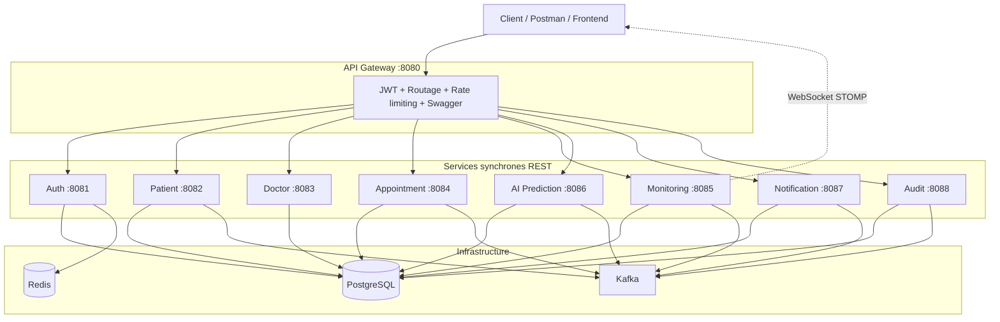
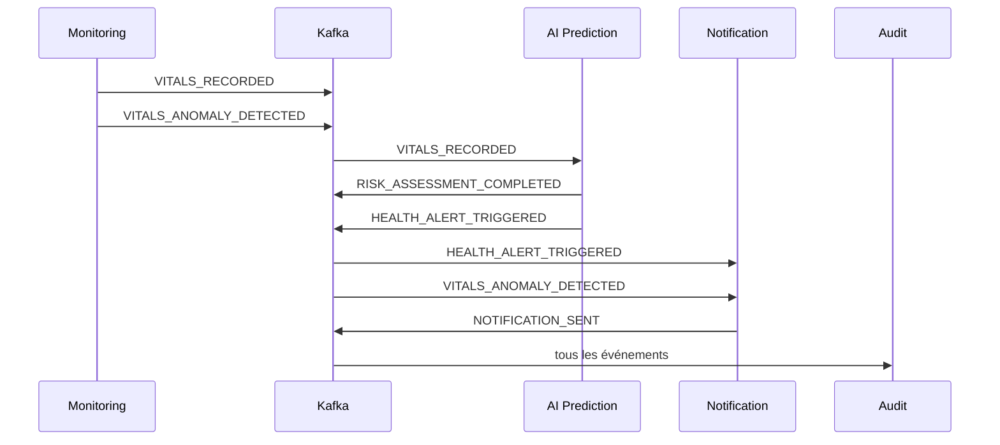

# Architecture — MedNova AI

> Plateforme de santé prédictive en microservices Spring Boot 3.4 / Java 21

## Vue d'ensemble

MedNova AI suit une architecture **microservices event-driven** avec un point d'entrée unique (API Gateway), une authentification centralisée (JWT + RBAC) et une communication asynchrone via **Apache Kafka**.



## Principes architecturaux

| Principe | Application dans MedNova |
|----------|-------------------------|
| **Clean Architecture** | Chaque service : `domain` → `application` → `infrastructure` → `presentation` |
| **DDD** | Agrégats métier (Patient, Appointment, VitalReading, RiskAssessment…) |
| **Event-Driven** | Topic unique `mednova.domain.events` + enveloppe `BaseEvent<T>` |
| **Database per service** | 8 bases PostgreSQL isolées |
| **API Gateway** | Routage, JWT, propagation `X-User-Id` / `X-User-Roles` |
| **RBAC** | 5 rôles — voir [README](../README.md#rôles-et-permissions-rbac) |

## Flux événementiel principal

Chaîne critique testée en démo : **vitals → anomalie → AI → alerte → notification → audit**.



### Catalogue des événements

| Événement | Producteur | Consommateur(s) |
|-----------|------------|-----------------|
| `PATIENT_CREATED` | Patient | Audit |
| `VITALS_RECORDED` | Monitoring | AI, Audit |
| `VITALS_ANOMALY_DETECTED` | Monitoring | Notification, Audit |
| `RISK_ASSESSMENT_COMPLETED` | AI | Audit |
| `HEALTH_ALERT_TRIGGERED` | AI | Notification, Audit |
| `APPOINTMENT_SCHEDULED` | Appointment | Notification, Audit |
| `APPOINTMENT_CANCELLED` | Appointment | Notification, Audit |
| `NOTIFICATION_SENT` | Notification | Audit |

## Structure d'un microservice

```
src/main/java/com/mednova/{service}/
├── domain/
│   ├── model/          # Entités métier
│   └── port/           # Interfaces (repositories)
├── application/
│   ├── service/        # Use cases
│   └── security/       # AccessGuard RBAC
├── infrastructure/
│   ├── persistence/    # JPA entities, adapters
│   ├── kafka/          # Consumers / producers
│   └── config/         # Security, Kafka, OpenAPI
└── presentation/
    ├── rest/           # Controllers
    ├── dto/            # Request / Response
    └── mapper/         # DTO ↔ Domain
```

## Sécurité

```
Client
  │  Authorization: Bearer <JWT>
  ▼
API Gateway
  │  Valide JWT (secret partagé)
  │  Ajoute X-User-Id, X-User-Roles, X-Correlation-Id
  ▼
Microservice
  │  GatewayHeaderAuthenticationFilter
  │  *AccessGuard (RBAC métier)
  ▼
Use case
```

## Bases de données (PostgreSQL)

| Base | Service | Tables principales |
|------|---------|-------------------|
| `auth_db` | Auth | users, roles |
| `patient_db` | Patient | patients |
| `doctor_db` | Doctor | doctors, availabilities |
| `appointment_db` | Appointment | appointments |
| `monitoring_db` | Monitoring | vital_readings |
| `ai_db` | AI Prediction | risk_assessments |
| `notification_db` | Notification | notifications |
| `audit_db` | Audit | audit_events |

## Ports et routage Gateway

| Port | Service | Préfixe Gateway |
|------|---------|-----------------|
| 8080 | API Gateway | — |
| 8081 | Auth | `/api/v1/auth/**` |
| 8082 | Patient | `/api/v1/patients/**` |
| 8083 | Doctor | `/api/v1/doctors/**` |
| 8084 | Appointment | `/api/v1/appointments/**` |
| 8085 | Monitoring | `/api/v1/monitoring/**`, `/ws/**` |
| 8086 | AI Prediction | `/api/v1/ai/**` |
| 8087 | Notification | `/api/v1/notifications/**` |
| 8088 | Audit | `/api/v1/audit/**` |

## Déploiement

| Mode | Commande | Usage |
|------|----------|-------|
| **Infra seule** | `docker compose up -d` | Dev local (services lancés via Maven) |
| **Stack complète** | `docker compose -f docker-compose.yml -f docker-compose.apps.yml up --build -d` | Démo / intégration Docker |
| **CI** | GitHub Actions `mvn verify` | Build + tests unitaires |

Voir aussi [API.md](API.md) pour les endpoints détaillés.
